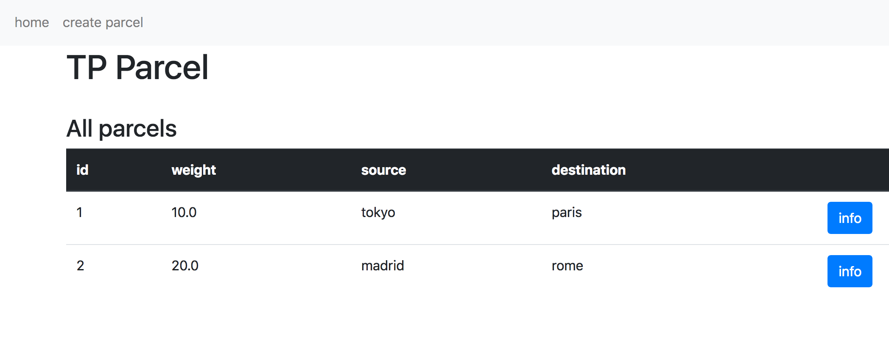

# TP1 Java ee réalisé par Bruno PIZZO et Tristan Marie

Une application qui permet de créer et suivre (modifier) la localistaion de colis.

## Entity

Les objets persistents sont : Parcel et Track, la relation qu'il y a entre les deux est One to many (1 parcel : n track).

Quand une entité est créé l'ID est autogeneré (autoincrement)

```java

@Id
@GeneratedValue(strategy = GenerationType.SEQUENCE)
private int id;

```


Pour la persistence nous avons utilisé utilise EclipseLink avec la proprieté : drop-and-create 

## Usage

L'application possede trois pages :

1. la page d'acceuil qui liste tous les colis créé

2. la page create parcel qui possede un formulaire pour creer un colis

3. une page de suivi de colis (accessible via le boutton "info" d'un colis dans la page d'acceuil), sur cette page on peut ajouter une trace sur le colis, livrer le colis et voir l'historique du colis.

Quand le colis est livré on ne peut plus le modifier


La page d'acceuil se trouve à l'addresse :


127.0.0.1:PORT/web/home


 
